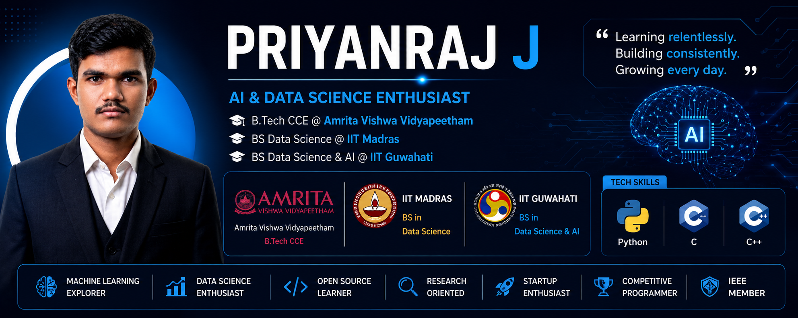

<h1 align="center">👋 Hi, I'm Priyanraj J</h1>

<h3 align="center">
AI & Data Science Enthusiast | B.Tech CCE @ Amrita | IIT Madras BS DS | IIT Guwahati BS DSAI
</h3>

<h3 align="center">
Research Oriented Learner 🚀
</h3>

<p align="center">

</p>

---

# 🚀 About Me

```yaml
Name       : Priyanraj J
Education  : Amrita + IIT Madras + IIT Guwahati
Degree     : B.Tech CCE + Dual BS Degrees
Year       : 2nd Year
Location   : Tamil Nadu, India
```

### 🌱 Currently Learning

- Python
- C Programming
- C++
- Data Structures & Algorithms
- Machine Learning
- Artificial Intelligence

### 🔭 Exploring

- AI & Machine Learning
- Data Science
- Research
- Software Engineering
- Open Source
- Startups
- Competitive Programming

---

# 🎓 Education

| Degree | Institute |
|----------|----------|
| B.Tech Computer & Communication Engineering | Amrita Vishwa Vidyapeetham |
| BS Data Science & Applications | IIT Madras |
| BS Data Science & AI | IIT Guwahati |

---

# 💻 Tech Stack

<p align="center">


</p>

---

# 📂 Featured Projects

## 💊 Pharmaceutical Evergreening Detection and Management

- Built using C Programming
- Pharmaceutical data management
- Drug lifecycle analysis

---

## 🤖 Smart Autonomous Patrol Robot

### Features

- Obstacle Avoidance
- Gas Detection
- Temperature Monitoring
- Velocity Tracking

---

## 🐍 Python Learning Repository

- Python Practice Programs
- Problem Solving
- Beginner Projects

---

# 🏆 Certifications

✅ NPTEL – The Joy of Computing Using Python

✅ NPTEL – English Language for Competitive Exams

✅ Infosys – Computational Problem Solving

✅ IIT Guwahati BS DS & AI Orientation Course

✅ IEEE Membership

---

# 🧠 Competitive Programming

### LeetCode

https://leetcode.com/u/PRIYANRAJ

### HackerRank

https://www.hackerrank.com/

### GitHub

https://github.com/priyanrajj-hub

---

# 🌐 Connect With Me

<p align="center">

<a href="https://www.linkedin.com/in/priyanraj">

</a>

<a href="mailto:priyanrajj@gmail.com">

</a>

</p>

---

# 📊 GitHub Stats

<p align="center">


</p>

---

# 🔥 GitHub Streak

<p align="center">


</p>

---

# 📈 Contribution Graph

<p align="center">


</p>

---

# 🏅 Achievements

🏆 IEEE Member

🏆 Pursuing Dual IIT Degrees Alongside B.Tech

🏆 AI & Data Science Enthusiast

🏆 Research Oriented Learner

🏆 Open Source Explorer

---

# 💻 Workspace

🖥️ ASUS TUF Gaming Laptop

⚙️ Intel Core i7

🎮 NVIDIA RTX 5060

---

# 🎯 2026 Goals

- Master Python
- Build AI Projects
- Contribute to Open Source
- Improve Competitive Programming
- Crack GATE CSE
- Build Research Portfolio

---

<h3 align="center">

🦇 Learning relentlessly. Building consistently. Growing every day.

</h3>

---

<h3 align="center">

⭐ Thanks for visiting my profile ⭐

</h3>
