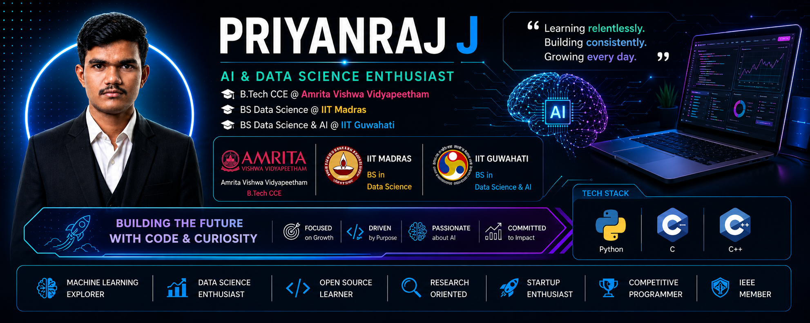

<div align="center">

```
██████╗ ██████╗ ██╗██╗   ██╗ █████╗ ███╗   ██╗██████╗  █████╗      ██╗
██╔══██╗██╔══██╗██║╚██╗ ██╔╝██╔══██╗████╗  ██║██╔══██╗██╔══██╗     ██║
██████╔╝██████╔╝██║ ╚████╔╝ ███████║██╔██╗ ██║██████╔╝███████║     ██║
██╔═══╝ ██╔══██╗██║  ╚██╔╝  ██╔══██║██║╚██╗██║██╔══██╗██╔══██║██   ██║
██║     ██║  ██║██║   ██║   ██║  ██║██║ ╚████║██║  ██║██║  ██║╚█████╔╝
╚═╝     ╚═╝  ╚═╝╚═╝   ╚═╝   ╚═╝  ╚═╝╚═╝  ╚═══╝╚═╝  ╚═╝╚═╝  ╚═╝ ╚════╝
```

### `AI & Data Science Enthusiast | Builder | Researcher`

---

[](https://www.linkedin.com/in/priyanraj)
[](mailto:priyanrajj@gmail.com)
[](https://leetcode.com/PRIYANRAJ)
[](https://github.com/priyanrajj-hub)
[](https://github.com/priyanrajj-hub)

---

[](https://git.io/typing-svg)

</div>

---

## `$ whoami`

```yaml
name       : Priyanraj J
location   : Tamil Nadu, India
education  : Amrita Vishwa Vidyapeetham + IIT Madras + IIT Guwahati
degrees    : B.Tech CCE  +  BS Data Science  +  BS DSAI
year       : First Year (2025–2029)
goal       : AI Researcher & Software Engineer
ieee       : Active Member
```

> *"Exploring multiple domains and building a strong interdisciplinary foundation before specializing."*

---

## 🎓 Education

| Institution | Programme | Status |
|---|---|---|
| 🏛 **Amrita Vishwa Vidyapeetham**, Chennai | B.Tech — Computer & Communication Engineering | 🟢 Active |
| 🔬 **IIT Madras** | BS — Data Science and Applications | 🟢 Active |
| ⚙️ **IIT Guwahati** | BS — Data Science and Artificial Intelligence | 🟢 Active |

---

## 🛠 Tech Stack

<div align="center">


</div>

**Learning →** DSA · Machine Learning · AI · Data Structures

**Exploring →** Open Source · Research · Embedded Systems · Startups · Stock Market

---

## 📂 Projects

### 💊 Pharmaceutical Evergreening Detection & Management
> Patent registry in **C** — fuzzy drug name matching via Levenshtein edit distance, struct-based records, file I/O, category/date table display.


---

### 🤖 Smart Autonomous Patrol Robot
> Obstacle avoidance, gas & temperature sensors, velocity tracking, autonomous navigation.


---

### 🐍 Student Management System
> Python CLI — attendance, ranking, CSV export, backup, reporting.


[](https://github.com/priyanrajj-hub/student-management-system-python)

---

## 📊 GitHub Stats

<div align="center">


</div>

---

## 🏆 Certifications

| | Certification |
|---|---|
| ✦ | **NPTEL** — The Joy of Computing Using Python |
| ✦ | **NPTEL** — English Language for Competitive Exams |
| ✦ | **Infosys** — Computational Problem Solving |
| ✦ | **IIT Guwahati** — BS DSAI Orientation Course |
| ✦ | **IEEE** — Active Member |

---

## ⚔️ Competitive Programming

<div align="center">

[](https://leetcode.com/PRIYANRAJ)
[](https://codeforces.com/profile/user_733863963)
[](https://atcoder.jp/users/priyanraj)
[](https://hackerrank.com/priyanraj)

</div>

---

## 🎯 2026 Roadmap

```
Q2 2026  ████████░░  Master Python + DSA
Q3 2026  ██████░░░░  Build & deploy first AI/ML project  
Q4 2026  ████░░░░░░  Open Source + research portfolio
2027     ██░░░░░░░░  GATE CSE prep · publish technical work
```

---
---
## 🚀 Personal Brand

<div align="center">



</div>

---


## 💻 Workspace

| | |
|---|---|
| 🖥 | ASUS TUF Gaming Laptop |
| ⚙️ | Intel Core i7 |
| 🎮 | NVIDIA RTX 5060 |
| 📍 | Tamil Nadu, India · UTC+5:30 |

---

<div align="center">

**🦇 Learning Relentlessly · Building Consistently · Growing Every Day**

</div>
